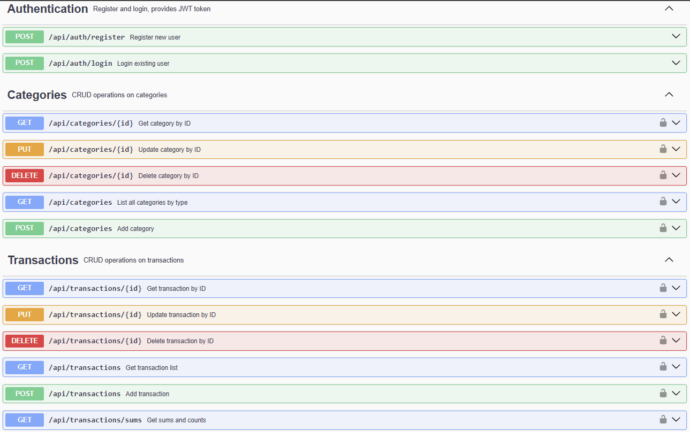

# 💰 Finance Tracker (Spring Boot + Docker)

Personal finance tracker backend - manage your expenses and income via a secure REST API.

- 📦 Fullstack project (backend ready, frontend in progress)
- 🐳 Dockerized with MySQL and phpMyAdmin
- 🧪 Unit and integration tested (examples, in progress)
- 📚 OpenAPI (Swagger) documentation available

---

## Preview




---

## 🧱 Technologies

- Java 21+
- Spring Boot (Web, Data JPA, Security)
- MySQL
- JWT authentication
- Docker & Docker Compose
- Swagger (springdoc-openapi)
- Postman (collection included)

---

## 🚀 How to start

### 1. Clone the project

```bash
git clone http://github.com/rudkura/finance-tracker
cd finance-tracker
```

### 2. Create `.env` file

Create a file named `.env` in the project root:

```env
TOKEN_SIGN_KEY=your_jwt_secret
```

### 3. Run with Docker Compose

```bash
docker-compose up --build
```

- backend has to wait for MySQL database to be fully ready.
- this may result in short delay for backend to start booting after MySQL finishes

Access:
- Backend: [http://localhost:8000](http://localhost:8000)
- Swagger UI: [http://localhost:8080/swagger-ui/index.html](http://localhost:8080/swagger-ui/index.html)
- phpMyAdmin: [http://localhost:8081](http://localhost:8081)
- Frontend: to be added

## 🧪 Testing

This project includes examples:

- ✅ Unit tests for transaction logic
- ✅ Integration test for transaction creation

## 📬 API Docs

Swagger UI: [http://localhost:8080/swagger-ui/index.html](http://localhost:8080/swagger-ui/index.html)

Postman collection:
```
postman/FinanceTracker.postman_collection.json
```

---

## 🛠️ Project structure

```
finance-tracker/
├── backend/            # Spring Boot project
├── frontend/           # Frontend placeholder
├── postman/            # Postman collection
├── assets/             # Assets
├── docker-compose.yml  # Docker config
├── .env                # (not committed) ENV variables
├── .gitignore
├── README.md
```

## 🔜 TODO

- [ ] Build frontend in React (planned)
- [ ] Add more tests
- [ ] Add support for recurring transactions
- [ ] User related IDs for categories?
- [ ] User email verification
- [ ] Export data CSV/Json

---

## ⚖ Licence

MIT License  
© 2025 Rudolf Kura
